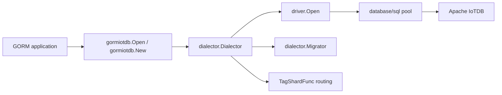

# Design

## Mapping Model

- `iotdb:time` fields are treated as the time axis.
- `iotdb:tag` fields are treated as routing and filter tags.
- Remaining fields are emitted as measurement columns.
- `type:...` preserves explicit IoTDB type choices for newer 2.x data types.

## Notes

- The dialector keeps the original `Open(dsn)` ergonomics and adds `New(Config)`.
- The create callback delegates to GORM's default create path unless `TagShardFunc` is enabled for slice inserts.
- The migrator intentionally no-ops relational-only constructs such as foreign keys and indexes.
